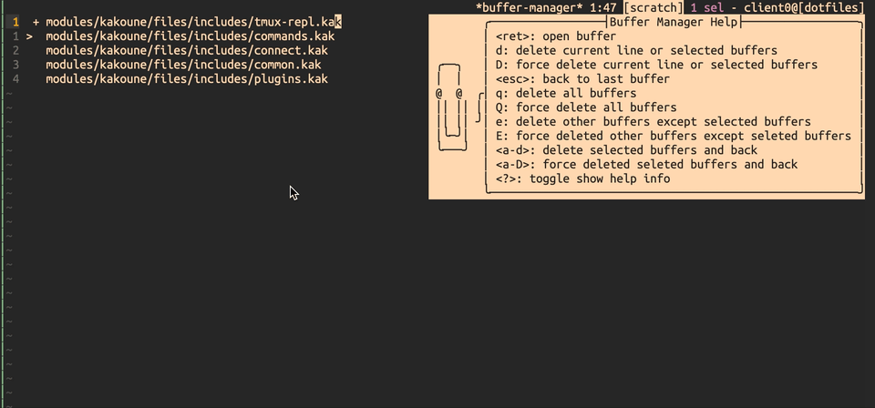

# Kakoune Buffer Manager




> I'm new to kakoune, and this is my first kakoune plugin, I have't done much testing, If you are willing to try it, welcome! I'll delete this when I've used it myself many times.

## Installations

Add `rc/buffer-manager.kak` to your autoload dir: `~/.config/kak/autoload/`

Or via [plug.kak](https://github.com/andreyorst/plug.kak):

```bash
plug 'theowenyoung/kakoune-buffer-manager' config %{
    map global normal <c-a-b> ': buffer-manager<ret>' -docstring 'open buffer manager'
}

```

## Features

- Switch buffer
- Delete buffer
- Delete multiple Buffer
- Force delete Buffer
- Delete buffers except selections
- Delete all buffers

## Usage

```bash
<ret>: open buffer
d: delete current line or selected buffers
D: force delete current line or selected buffers
<esc>: back to last buffer
q: delete all buffers
Q: force delete all buffers
e: delete other buffers except selected buffers
E: force deleted other buffers except seleted buffers
<a-d>: delete selected buffers and back
<a-D>: force deleted seleted buffers and back
<?>: toggle show help info
```

## Inspired/Related

- [kakoune-buffer-switcher](https://github.com/occivink/kakoune-buffer-switcher)
- [kakoune-buffers](https://github.com/Delapouite/kakoune-buffers)

